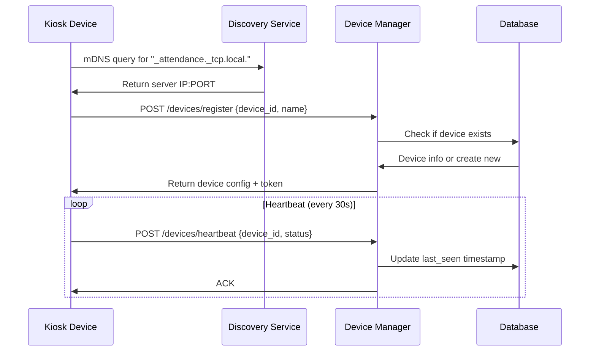
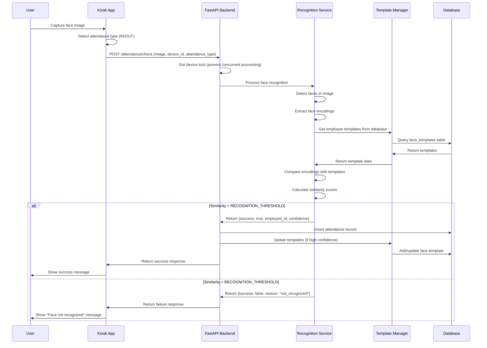
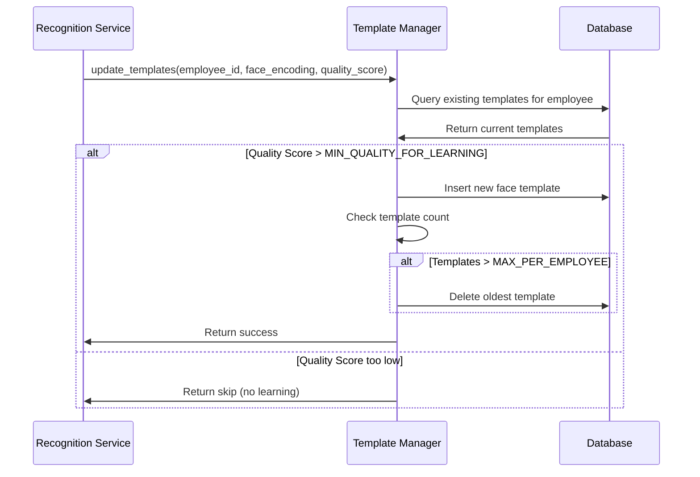
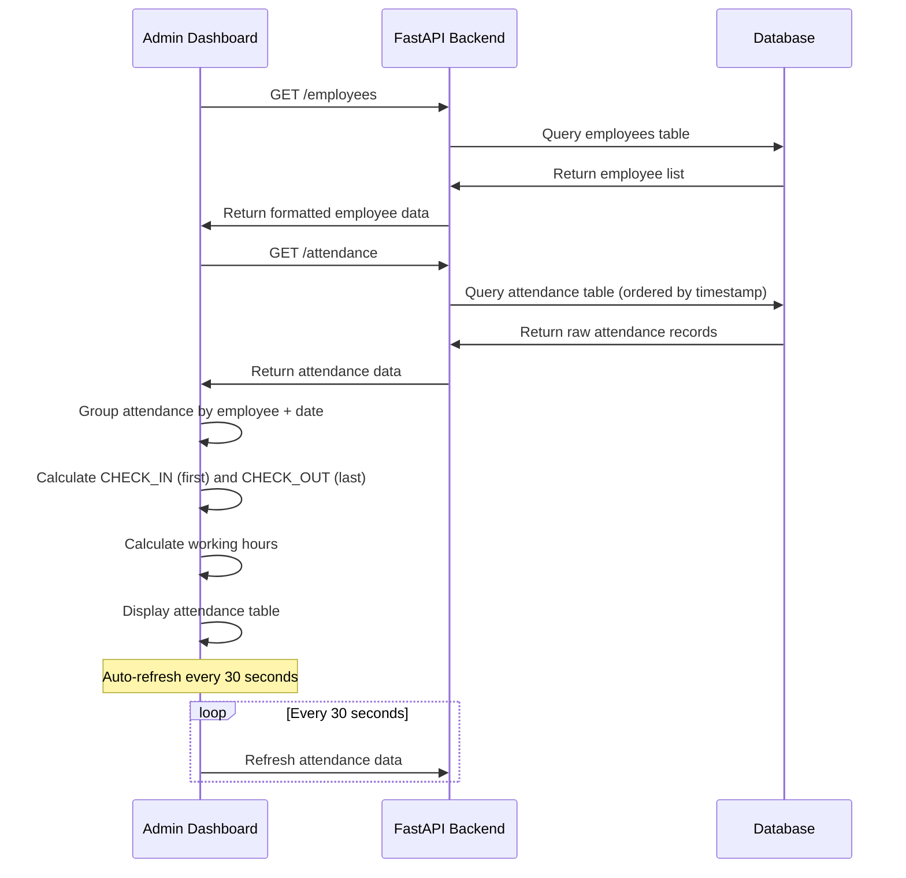
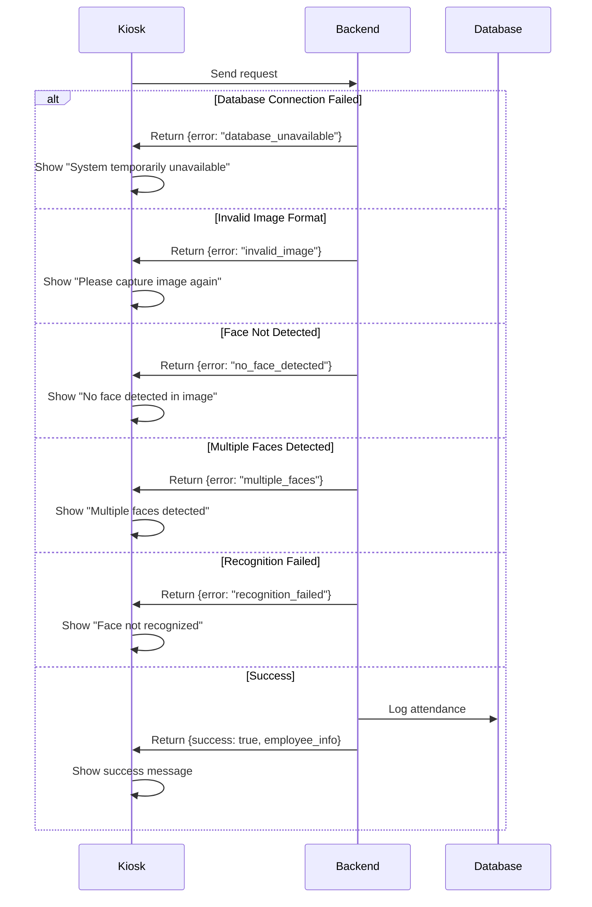

# Phân Tích Hệ Thống Backend - Hệ Thống Chấm Công Nhận Diện Khuôn Mặt

## 📋 Tổng Quan Dự Án

### Mục Đích & Chức Năng Chính
**Hệ Thống Chấm Công Nhận Diện Khuôn Mặt** là một giải pháp công nghệ thông minh được thiết kế để:

- **Tự động hóa quy trình chấm công**: Thay thế các phương pháp chấm công truyền thống (thẻ từ, vân tay) bằng công nghệ nhận diện khuôn mặt
- **Quản lý đa thiết bị**: Hỗ trợ nhiều máy chấm công (kiosk) hoạt động đồng thời trong cùng hệ thống mạng
- **Theo dõi thời gian thực**: Giám sát việc chấm công, tình trạng thiết bị và kết nối liên tục
- **Quản lý nhân viên tập trung**: Bảng điều khiển quản trị để quản lý nhân viên, thiết bị và báo cáo

> **Giải thích thuật ngữ:**
> - **Kiosk**: Máy tính đặt tại các vị trí cố định (cửa ra vào) để nhân viên thực hiện chấm công
> - **Real-time**: Thời gian thực - xử lý và cập nhật dữ liệu ngay lập tức
> - **Dashboard**: Bảng điều khiển - giao diện tổng quan để quản lý và theo dõi hệ thống

### Vấn Đề Dự Án Giải Quyết
1. **Ngăn chặn gian lận chấm công**: Tránh tình trạng "chấm công hộ" nhờ vào công nghệ nhận diện khuôn mặt chính xác
2. **Đơn giản hóa quản lý**: Tập trung hóa việc quản lý chấm công từ nhiều địa điểm khác nhau
3. **Tích hợp dễ dàng**: Tự động phát hiện và kết nối các máy chấm công thông qua công nghệ mDNS
4. **Nâng cao độ chính xác**: Sử dụng trí tuệ nhân tạo và hệ thống mẫu học liên tục để cải thiện độ chính xác theo thời gian

> **Giải thích thuật ngữ:**
> - **mDNS**: Multicast DNS - công nghệ giúp các thiết bị tự động tìm thấy nhau trong mạng nội bộ
> - **Template System**: Hệ thống mẫu - lưu trữ và cập nhật các đặc trưng khuôn mặt để cải thiện nhận diện
> - **AI**: Artificial Intelligence - Trí tuệ nhân tạo

---

## 🛠️ Công Nghệ & Công Cụ Sử Dụng

### Ngôn Ngữ Lập Trình
- **Python 3.10+**: Ngôn ngữ chính cho backend (phần máy chủ)
- **JavaScript**: Ngôn ngữ cho giao diện quản trị web
- **Dart/Flutter**: Ngôn ngữ cho ứng dụng máy chấm công

> **Giải thích thuật ngữ:**
> - **Backend**: Phần hệ thống chạy trên máy chủ, xử lý logic nghiệp vụ và dữ liệu
> - **Frontend**: Phần giao diện người dùng, hiển thị trên màn hình và tương tác trực tiếp

### Framework & Thư Viện Chính

#### Framework Backend (Khung Phát Triển Máy Chủ)
- **FastAPI 0.104.1**: Framework web hiện đại với khả năng xử lý bất đồng bộ cao
- **Uvicorn**: Máy chủ ASGI hiệu suất cao để chạy ứng dụng web
- **SQLAlchemy 2.0.23**: Công cụ ORM để thao tác với cơ sở dữ liệu bằng Python
- **Alembic 1.12.1**: Công cụ quản lý phiên bản và migration cơ sở dữ liệu
- **Pydantic 2.5.0**: Thư viện xác thực và chuyển đổi dữ liệu đầu vào/đầu ra

> **Giải thích thuật ngữ:**
> - **Framework**: Khung phát triển - bộ công cụ và thư viện có sẵn giúp phát triển ứng dụng nhanh hơn
> - **ASGI**: Asynchronous Server Gateway Interface - giao thức cho máy chủ web bất đồng bộ
> - **ORM**: Object-Relational Mapping - công nghệ ánh xạ dữ liệu từ cơ sở dữ liệu thành đối tượng Python
> - **Migration**: Quá trình cập nhật cấu trúc cơ sở dữ liệu một cách có kiểm soát

#### Thư Viện AI/ML (Trí Tuệ Nhân Tạo / Học Máy)
```python
# Xử lý hình ảnh & nhận diện khuôn mặt
opencv-python==4.8.1.78           # Thư viện xử lý hình ảnh máy tính
face-recognition==1.3.0            # Thư viện nhận diện và mã hóa khuôn mặt
insightface==0.7.3                 # Thư viện nhận diện khuôn mặt nâng cao
dlib==19.24.2                      # Bộ công cụ học máy

# Học sâu (Deep Learning)
torch==2.1.1, torchvision==0.16.1  # Framework PyTorch cho học sâu
ultralytics==8.0.196               # YOLOv11 để phát hiện đối tượng
onnxruntime==1.16.3                # Công cụ chạy mô hình ONNX

# Tính toán khoa học
numpy==1.24.3, scipy==1.11.4       # Thư viện tính toán số học
scikit-learn==1.3.0                # Thuật toán học máy
```

> **Giải thích thuật ngữ:**
> - **Computer Vision**: Thị giác máy tính - khả năng máy tính "nhìn" và hiểu hình ảnh
> - **Deep Learning**: Học sâu - loại AI sử dụng mạng nơ-ron nhiều lớp
> - **YOLO**: You Only Look Once - thuật toán phát hiện đối tượng trong thời gian thực
> - **ONNX**: Open Neural Network Exchange - định dạng mở để trao đổi mô hình AI
> - **Neural Network**: Mạng nơ-ron - mô hình toán học mô phỏng cách hoạt động của não bộ

#### Bảo Mật & Xác Thực
- **python-jose[cryptography]**: Quản lý token JWT để xác thực người dùng
- **passlib[bcrypt]**: Mã hóa mật khẩu an toàn
- **python-multipart**: Xử lý tải lên file đa phần

> **Giải thích thuật ngữ:**
> - **JWT**: JSON Web Token - chuẩn mở để truyền thông tin an toàn giữa các bên
> - **Hashing**: Băm - quá trình biến đổi dữ liệu thành chuỗi ký tự cố định, không thể đảo ngược
> - **Bcrypt**: Thuật toán băm mật khẩu với độ bảo mật cao

### Cơ Sở Dữ Liệu & Tổ Chức Dữ Liệu

#### Engine Cơ Sở Dữ Liệu
- **PostgreSQL**: Hệ quản trị cơ sở dữ liệu quan hệ chính với kết nối psycopg2-binary
- **SQLAlchemy ORM**: Ánh xạ quan hệ đối tượng với hỗ trợ bất đồng bộ

> **Giải thích thuật ngữ:**
> - **PostgreSQL**: Hệ quản trị cơ sở dữ liệu mã nguồn mở, mạnh mẽ và ổn định
> - **Relational Database**: Cơ sở dữ liệu quan hệ - tổ chức dữ liệu dưới dạng bảng có liên kết
> - **Async**: Bất đồng bộ - khả năng xử lý nhiều tác vụ cùng lúc mà không chờ đợi

#### Cấu Trúc Mô Hình Dữ Liệu
```python
# Các mô hình dữ liệu chính
├── Employee          # Nhân viên (mã NV, họ tên, phòng ban, ...)
├── Device           # Thiết bị kiosk (mã thiết bị, tên, địa chỉ IP, trạng thái)
├── Attendance       # Lịch sử chấm công (mã NV, mã thiết bị, thời gian, loại hành động)
├── FaceTemplate     # Mẫu nhận diện (mã NV, dữ liệu đặc trưng, điểm chất lượng)
└── NetworkLog       # Nhật ký hoạt động mạng và thiết bị
```

#### Mối Quan Hệ Dữ Liệu
- **Employee 1:N Attendance**: Một nhân viên có nhiều bản ghi chấm công
- **Employee 1:N FaceTemplate**: Một nhân viên có nhiều mẫu khuôn mặt (hệ thống học liên tục)
- **Device 1:N Attendance**: Một thiết bị xử lý nhiều lần chấm công
- **Device 1:N NetworkLog**: Theo dõi hoạt động của thiết bị

> **Giải thích thuật ngữ:**
> - **1:N**: Quan hệ một-nhiều - một bản ghi ở bảng này liên kết với nhiều bản ghi ở bảng khác
> - **Template**: Mẫu - dữ liệu đặc trưng của khuôn mặt được lưu trữ để so sánh
> - **Log**: Nhật ký - ghi lại các sự kiện và hoạt động của hệ thống

### Công Nghệ Hạ Tầng

#### Khám Phá Dịch Vụ (Service Discovery)
- **mDNS/Bonjour**: Tự động phát hiện máy chủ trong mạng nội bộ
- **Tên dịch vụ**: `_attendance._tcp.local.`
- **Mạng không cấu hình**: Các thiết bị kiosk tự động kết nối với máy chủ

> **Giải thích thuật ngữ:**
> - **Service Discovery**: Khám phá dịch vụ - cơ chế tự động tìm và kết nối các dịch vụ trong mạng
> - **Bonjour**: Công nghệ của Apple cho việc khám phá dịch vụ tự động
> - **Zero-config**: Không cần cấu hình - tự động thiết lập kết nối

#### Kiến Trúc API
- **RESTful APIs**: API tuân theo chuẩn REST với các phương thức HTTP tiêu chuẩn
- **Xử lý bất đồng bộ**: FastAPI async/await cho khả năng xử lý đồng thời cao
- **Giao tiếp thời gian thực**: Cơ chế heartbeat để giám sát thiết bị

> **Giải thích thuật ngữ:**
> - **REST**: Representational State Transfer - kiểu kiến trúc phần mềm cho dịch vụ web
> - **API**: Application Programming Interface - giao diện lập trình ứng dụng
> - **HTTP**: Hypertext Transfer Protocol - giao thức truyền tải siêu văn bản
> - **Heartbeat**: Tín hiệu "nhịp tim" - tín hiệu định kỳ để xác nhận thiết bị vẫn hoạt động

#### Container & Triển Khai
```dockerfile
# Hỗ trợ Docker
├── Dockerfile                    # Đóng gói backend thành container
├── docker-compose.local.yml      # Cấu hình phát triển local
├── docker-compose.prod.yml       # Cấu hình triển khai production
└── nginx/                        # Cấu hình reverse proxy
```

> **Giải thích thuật ngữ:**
> - **Docker**: Công nghệ container hóa ứng dụng
> - **Container**: Gói phần mềm bao gồm ứng dụng và tất cả phụ thuộc
> - **Reverse Proxy**: Máy chủ trung gian chuyển tiếp yêu cầu từ client đến server thực

---

## 🏗️ Kiến Trúc & Cấu Trúc Dự Án

### Mô Hình Kiến Trúc
**Kiến Trúc Đa Tầng Client-Server với Các Thành Phần Microservices**:

> **Giải thích thuật ngữ:**
> - **Multi-Tier**: Đa tầng - chia hệ thống thành các tầng logic riêng biệt
> - **Client-Server**: Mô hình máy khách-máy chủ - clients gửi yêu cầu, server xử lý và phản hồi
> - **Microservices**: Kiến trúc vi dịch vụ - chia ứng dụng thành các dịch vụ nhỏ độc lập

```
┌─────────────────┐    ┌─────────────────┐    ┌─────────────────┐
│  Ứng Dụng Kiosk │    │ Bảng Điều Khiển│    │  Ứng Dụng Di    │
│   (Flutter)     │    │ Quản Trị (React)│    │  Động (Tương lai)│
└─────────────────┘    └─────────────────┘    └─────────────────┘
         │                       │                       │
         └───────────────────────┼───────────────────────┘
                                 │
              ┌─────────────────────────────────────┐
              │         Backend FastAPI             │
              │  ┌─────────────────────────────────┐│
              │  │      Tầng Dịch Vụ              ││
              │  │ ┌─────────┐ ┌─────────────────┐ ││
              │  │ │Dịch Vụ  │ │Quản Lý Thiết Bị │ ││
              │  │ │AI/ML    │ │& Khám Phá       │ ││
              │  │ └─────────┘ └─────────────────┘ ││
              │  └─────────────────────────────────┘│
              │  ┌─────────────────────────────────┐│
              │  │         Tầng API                ││
              │  │ /employees /devices /attendance ││
              │  └─────────────────────────────────┘│
              └─────────────────────────────────────┘
                                 │
              ┌─────────────────────────────────────┐
              │      Cơ Sở Dữ Liệu PostgreSQL      │
              │ ┌─────────┐ ┌─────────┐ ┌─────────┐ │
              │ │nhân viên│ │thiết bị │ │chấm công│ │
              │ │mẫu nhận │ │nhật ký  │ │...      │ │
              │ │diện     │ │         │ │         │ │
              │ └─────────┘ └─────────┘ └─────────┘ │
              └─────────────────────────────────────┘
```

### Cách Tổ Chức Thư Mục & File Code

```
backend/
├── app/
│   ├── main.py                 # Điểm khởi động FastAPI & cấu hình ứng dụng
│   ├── config/                 # Quản lý cấu hình
│   │   ├── database.py         # Cấu hình kết nối cơ sở dữ liệu
│   │   ├── multi_kiosk_config_fixed.py  # Cấu hình đa kiosk
│   │   └── settings.py         # Cài đặt ứng dụng
│   ├── models/                 # Mô hình dữ liệu SQLAlchemy ORM
│   │   ├── base.py            # Lớp mô hình cơ sở
│   │   ├── employee.py        # Mô hình dữ liệu nhân viên
│   │   ├── device.py          # Mô hình quản lý thiết bị
│   │   ├── attendance.py      # Mô hình bản ghi chấm công
│   │   ├── face_template.py   # Mô hình lưu trữ mẫu khuôn mặt
│   │   └── network_log.py     # Nhật ký hoạt động mạng
│   ├── schemas/               # Schemas xác thực dữ liệu Pydantic
│   │   ├── employee.py        # Schemas yêu cầu/phản hồi nhân viên
│   │   ├── device.py          # Schemas API thiết bị
│   │   └── attendance.py      # Schemas dữ liệu chấm công
│   ├── api/                   # Tổ chức các endpoint API
│   │   ├── v1/                # Phiên bản API 1
│   │   │   ├── employees.py   # Endpoints quản lý nhân viên
│   │   │   ├── devices.py     # Đăng ký & quản lý thiết bị
│   │   │   ├── attendance.py  # Endpoints xử lý chấm công
│   │   │   ├── auth.py        # Endpoints xác thực
│   │   │   ├── recognition.py # Endpoints nhận diện khuôn mặt
│   │   │   ├── discovery.py   # Endpoints khám phá dịch vụ
│   │   │   └── monitoring.py  # Endpoints giám sát hệ thống
│   │   └── templates.py       # API quản lý mẫu
│   ├── services/              # Dịch vụ logic nghiệp vụ
│   │   ├── enhanced_recognition_service.py     # Engine nhận diện chính
│   │   ├── enhanced_face_embedding_service.py  # Nhúng khuôn mặt & mẫu
│   │   ├── real_ai_service.py                  # Tích hợp mô hình AI
│   │   ├── template_manager_service.py         # Quản lý vòng đời mẫu
│   │   ├── device_manager.py                   # Vòng đời thiết bị & heartbeat
│   │   ├── device_service.py                   # Thao tác thiết bị
│   │   ├── discovery_service.py                # Khám phá dịch vụ mDNS
│   │   └── employee_service.py                 # Thao tác nhân viên
│   ├── core/                  # Tiện ích cốt lõi
│   │   ├── security.py        # Xác thực & phân quyền
│   │   └── dependencies.py    # Phụ thuộc FastAPI
│   └── utils/                 # Tiện ích hỗ trợ
│       ├── image_processing.py # Tiện ích xử lý hình ảnh
│       └── logging.py         # Cấu hình ghi nhật ký
├── data/                      # Lưu trữ dữ liệu
│   ├── uploads/               # Hình ảnh được tải lên
│   ├── models/                # File mô hình AI
│   └── employee_photos/       # Ảnh tham khảo nhân viên
├── alembic/                   # Migration cơ sở dữ liệu
├── requirements.txt           # Phụ thuộc Python
├── requirements_ai.txt        # Phụ thuộc AI cụ thể
└── Dockerfile                 # Cấu hình container
```

> **Giải thích thuật ngữ:**
> - **Schema**: Cấu trúc dữ liệu - định nghĩa format và quy tắc của dữ liệu đầu vào/ra
> - **Endpoint**: Điểm cuối - URL cụ thể mà client có thể gọi để truy cập chức năng
> - **Engine**: Động cơ - thành phần chính thực hiện một chức năng cụ thể
> - **Embedding**: Nhúng - biểu diễn dữ liệu (như khuôn mặt) dưới dạng vector số
> - **Migration**: Di cư - quá trình cập nhật cấu trúc cơ sở dữ liệu có kiểm soát

### Vai Trò Từng Module Chính

#### 1. **Tầng API (`app/api/`)**
- **Trách nhiệm**: Xử lý yêu cầu HTTP, xác thực đầu vào, định dạng phản hồi
- **Tính năng chính**: Endpoints RESTful, xử lý yêu cầu bất đồng bộ, xử lý lỗi
- **Modules chính**:
  - `employees.py`: Thao tác CRUD cho quản lý nhân viên
  - `devices.py`: Đăng ký thiết bị, heartbeat, quản lý trạng thái
  - `attendance.py`: Xử lý chấm công & truy xuất lịch sử
  - `recognition.py`: Endpoints API nhận diện khuôn mặt

> **Giải thích thuật ngữ:**
> - **CRUD**: Create, Read, Update, Delete - bốn thao tác cơ bản với dữ liệu
> - **HTTP**: Giao thức truyền tải siêu văn bản để giao tiếp web

#### 2. **Tầng Dịch Vụ (`app/services/`)**
- **Trách nhiệm**: Logic nghiệp vụ, xử lý AI, điều phối thiết bị
- **Tính năng chính**: Nhận diện khuôn mặt, quản lý mẫu, điều phối thiết bị
- **Modules chính**:
  - `enhanced_recognition_service.py`: Engine nhận diện cốt lõi
  - `device_manager.py`: Điều phối đa thiết bị & giám sát
  - `template_manager_service.py`: Hệ thống mẫu học liên tục
  - `discovery_service.py`: Khám phá dịch vụ mạng

#### 3. **Tầng Dữ Liệu (`app/models/` & `app/schemas/`)**
- **Trách nhiệm**: Lưu trữ dữ liệu, xác thực, tuần tự hóa
- **Tính năng chính**: Mô hình ORM, xác thực yêu cầu/phản hồi, thao tác cơ sở dữ liệu
- **Modules chính**:
  - Models: Định nghĩa thực thể cơ sở dữ liệu
  - Schemas: Xác thực yêu cầu/phản hồi API

#### 4. **Hạ Tầng Cốt Lõi (`app/core/` & `app/config/`)**
- **Trách nhiệm**: Cấu hình ứng dụng, bảo mật, tiện ích dùng chung
- **Tính năng chính**: Kết nối cơ sở dữ liệu, xác thực, ghi nhật ký, quản lý cài đặt

> **Giải thích thuật ngữ:**
> - **Business Logic**: Logic nghiệp vụ - quy tắc và quy trình xử lý theo yêu cầu kinh doanh
> - **Orchestration**: Điều phối - quản lý và phối hợp nhiều thành phần hoạt động cùng nhau
> - **Serialization**: Tuần tự hóa - chuyển đổi đối tượng thành format có thể truyền tải (JSON)

---

## 🧠 Thuật Toán & Logic Xử Lý

### Các Thuật Toán Chính

#### 1. **Quy Trình Nhận Diện Khuôn Mặt (Face Recognition Pipeline)**
```python
# Quy trình nhận diện đa giai đoạn
def recognize_face(image_bytes: bytes) -> Dict:
    # Giai đoạn 1: Phát hiện khuôn mặt
    faces = face_detector.detect_faces(image)
    
    # Giai đoạn 2: Đánh giá chất lượng khuôn mặt
    quality_score = assess_face_quality(face_roi)
    
    # Giai đoạn 3: Trích xuất đặc trưng
    face_encoding = extract_face_encoding(face_roi)
    
    # Giai đoạn 4: So khớp với mẫu
    best_match = compare_with_templates(face_encoding)
    
    # Giai đoạn 5: Kiểm tra ngưỡng tin cậy
    if similarity > RECOGNITION_THRESHOLD:
        return recognition_result
```

> **Giải thích thuật ngữ:**
> - **Face Detection**: Phát hiện khuôn mặt - tìm vị trí khuôn mặt trong ảnh
> - **ROI**: Region of Interest - vùng quan tâm, là phần ảnh chứa khuôn mặt
> - **Feature Extraction**: Trích xuất đặc trưng - chuyển đổi khuôn mặt thành vector số
> - **Encoding**: Mã hóa - biểu diễn khuôn mặt dưới dạng dãy số đặc trưng
> - **Threshold**: Ngưỡng - giá trị chuẩn để quyết định có chấp nhận kết quả hay không

**Phân cấp Ngưỡng Tin Cậy**:
- `RECOGNITION_THRESHOLD = 0.65`: Ngưỡng tối thiểu để nhận diện thành công
- `HIGH_CONFIDENCE_THRESHOLD = 0.75`: Ngưỡng tin cậy cao
- `VERY_HIGH_CONFIDENCE_THRESHOLD = 0.85`: Ngưỡng tin cậy rất cao

#### 2. **Hệ Thống Mẫu Học Liên Tục (Rolling Template System)**
```python
# Cơ chế học để cải thiện độ chính xác
class TemplateManager:
    def update_templates(self, employee_id: str, new_encoding: np.ndarray):
        # Lấy các mẫu hiện tại
        templates = get_employee_templates(employee_id)
        
        # Đánh giá chất lượng
        if quality_score > MIN_QUALITY_FOR_LEARNING:
            # Thêm mẫu mới
            add_template(employee_id, new_encoding, quality_score)
            
            # Duy trì giới hạn mẫu (cửa sổ trượt)
            if len(templates) > MAX_TEMPLATES_PER_EMPLOYEE:
                remove_oldest_template(employee_id)
```

> **Giải thích thuật ngữ:**
> - **Template**: Mẫu - dữ liệu đặc trưng khuôn mặt được lưu trữ để so sánh
> - **Rolling Window**: Cửa sổ trượt - giữ số lượng mẫu cố định, loại bỏ mẫu cũ khi thêm mẫu mới
> - **Quality Score**: Điểm chất lượng - đánh giá độ rõ nét và phù hợp của ảnh khuôn mặt
> - **Learning**: Học - quá trình cập nhật và cải thiện dữ liệu nhận diện

#### 3. **Thuật Toán Khám Phá Thiết Bị (Device Discovery)**
```python
# Khám phá dịch vụ mDNS
def discover_server():
    # Phát sóng truy vấn mDNS
    service_name = "_attendance._tcp.local."
    
    # Lắng nghe phản hồi
    servers = mdns_query(service_name)
    
    # Trả về thông tin máy chủ
    return {
        "host": server.address,        # Địa chỉ IP máy chủ
        "port": server.port,           # Cổng dịch vụ
        "service_type": server.type    # Loại dịch vụ
    }
```

> **Giải thích thuật ngữ:**
> - **Broadcast**: Phát sóng - gửi thông tin đến tất cả thiết bị trong mạng
> - **Query**: Truy vấn - yêu cầu tìm kiếm thông tin
> - **Host**: Máy chủ - thiết bị cung cấp dịch vụ
> - **Port**: Cổng - số định danh để truy cập dịch vụ cụ thể trên máy chủ

#### 4. **Điều Phối Đa Thiết Bị (Multi-Device Coordination)**
```python
# Quản lý thiết bị với giám sát heartbeat
class DeviceManager:
    async def process_attendance(self, device_id: str, image: bytes):
        # Lấy khóa riêng cho thiết bị
        async with device_locks[device_id]:
            # Xử lý nhận diện
            result = await recognition_service.recognize(image)
            
            # Ghi nhật ký chấm công
            await log_attendance(device_id, result)
            
            # Cập nhật trạng thái thiết bị
            await update_device_heartbeat(device_id)
```

> **Giải thích thuật ngữ:**
> - **Lock**: Khóa - cơ chế đảm bảo chỉ một tác vụ được thực hiện tại một thời điểm
> - **Async**: Bất đồng bộ - thực hiện nhiều tác vụ cùng lúc mà không chờ đợi
> - **Heartbeat**: Nhịp tim - tín hiệu định kỳ xác nhận thiết bị vẫn hoạt động
> - **Device Lock**: Khóa thiết bị - đảm bảo mỗi thiết bị chỉ xử lý một yêu cầu tại một thời điểm

### Cách Hệ Thống Xử Lý Dữ Liệu

#### 1. **Quy Trình Xử Lý Hình Ảnh (Image Processing Pipeline)**
```python
# Quy trình xử lý hình ảnh chấm công
def process_attendance_image(image_bytes: bytes):
    # 1. Xác thực & chuyển đổi hình ảnh
    image = cv2.imdecode(np.frombuffer(image_bytes, np.uint8), cv2.IMREAD_COLOR)
    
    # 2. Phát hiện khuôn mặt
    face_locations = face_recognition.face_locations(image)
    
    # 3. Đánh giá chất lượng
    quality_metrics = {
        "brightness": assess_brightness(face_roi),    # Độ sáng
        "sharpness": assess_sharpness(face_roi),      # Độ nét
        "size": assess_face_size(face_roi)            # Kích thước khuôn mặt
    }
    
    # 4. Trích xuất mã hóa khuôn mặt
    face_encodings = face_recognition.face_encodings(image, face_locations)
    
    # 5. So sánh với mẫu
    matches = compare_face_encodings(face_encodings, known_templates)
    
    return recognition_result
```

> **Giải thích thuật ngữ:**
> - **Decode**: Giải mã - chuyển đổi dữ liệu từ format này sang format khác
> - **Buffer**: Bộ đệm - vùng nhớ tạm thời lưu trữ dữ liệu
> - **RGB**: Red, Green, Blue - không gian màu với 3 kênh màu cơ bản
> - **Metrics**: Chỉ số - các giá trị đo lường chất lượng
> - **Brightness**: Độ sáng - mức độ ánh sáng trong ảnh
> - **Sharpness**: Độ nét - mức độ rõ ràng của chi tiết trong ảnh

#### 2. **Xử Lý Logic Chấm Công (Attendance Logic Processing)**
```python
# Nhóm và tính toán chấm công
def process_attendance_display(raw_attendance_data):
    # Nhóm theo nhân viên + ngày
    grouped = {}
    for record in raw_attendance_data:
        key = f"{record.employee_id}_{record.date}"
        grouped[key] = grouped.get(key, []).append(record)
    
    # Xử lý từng nhóm
    for group in grouped.values():
        # Sắp xếp theo thời gian
        sorted_records = sorted(group, key=lambda x: x.timestamp)
        
        # Tìm CHECK_IN đầu tiên và CHECK_OUT cuối cùng
        check_ins = [r for r in sorted_records if r.action_type == 'CHECK_IN']
        check_outs = [r for r in sorted_records if r.action_type == 'CHECK_OUT']
        
        first_in = check_ins[0] if check_ins else None
        last_out = check_outs[-1] if check_outs else None
        
        # Tính giờ làm việc
        if first_in and last_out:
            work_hours = calculate_hours(first_in.timestamp, last_out.timestamp)
```

> **Giải thích thuật ngữ:**
> - **Grouping**: Nhóm - tập hợp các bản ghi có cùng đặc điểm
> - **Sorting**: Sắp xếp - xếp dữ liệu theo thứ tự nhất định
> - **Timestamp**: Dấu thời gian - thời điểm cụ thể khi sự kiện xảy ra
> - **Lambda**: Hàm ẩn danh - hàm nhỏ được định nghĩa trực tiếp tại chỗ sử dụng

#### 3. **Tích Hợp Mô Hình AI (AI Model Integration)**
```python
# Dịch vụ AI trừu tượng
class RealAIService:
    def __init__(self):
        self.face_detector = MTCNN()      # Mạng nơ-ron đa nhiệm
        self.face_recognizer = ArcFace()  # Mô hình ArcFace
        
    def extract_face_embedding(self, face_image: np.ndarray) -> np.ndarray:
        # Tiền xử lý
        aligned_face = align_face(face_image)           # Căn chỉnh khuôn mặt
        normalized_face = normalize_image(aligned_face)  # Chuẩn hóa ảnh
        
        # Trích xuất đặc trưng
        embedding = self.face_recognizer.get_embedding(normalized_face)
        
        return embedding
    
    def compare_embeddings(self, embedding1: np.ndarray, embedding2: np.ndarray) -> float:
        # Tính độ tương tự cosine
        similarity = cosine_similarity(embedding1, embedding2)
        return similarity
```

> **Giải thích thuật ngữ:**
> - **MTCNN**: Multi-task CNN - mạng nơ-ron tích chập đa nhiệm cho phát hiện khuôn mặt
> - **ArcFace**: Thuật toán nhận diện khuôn mặt tiên tiến sử dụng học sâu
> - **Alignment**: Căn chỉnh - xoay và cắt khuôn mặt về vị trí chuẩn
> - **Normalization**: Chuẩn hóa - điều chỉnh giá trị pixel về khoảng chuẩn
> - **Embedding**: Vector nhúng - biểu diễn khuôn mặt dưới dạng vector số nhiều chiều
> - **Cosine Similarity**: Độ tương tự cosine - phương pháp đo độ giống nhau giữa hai vector

### Các Cơ Chế Tối Ưu

#### 1. **Tối Ưu Hiệu Suất (Performance Optimizations)**
- **Xử lý Bất đồng bộ**: FastAPI async/await cho xử lý yêu cầu đồng thời
- **Khóa Riêng Thiết bị**: Ngăn chặn xử lý đồng thời trên cùng một thiết bị
- **Cache Mẫu**: Lưu cache trong bộ nhớ cho các mẫu khuôn mặt
- **Nén Hình ảnh**: Tối ưu kích thước file ảnh được tải lên

> **Giải thích thuật ngữ:**
> - **Concurrent**: Đồng thời - nhiều tác vụ được thực hiện cùng lúc
> - **Cache**: Bộ nhớ đệm - lưu trữ tạm thời dữ liệu thường dùng để truy cập nhanh
> - **Compression**: Nén - giảm kích thước dữ liệu để tiết kiệm bộ nhớ và băng thông

#### 2. **Cải Thiện Độ Chính Xác (Accuracy Improvements)**
- **Hệ Thống Mẫu Học Liên Tục**: Học từ các lần nhận diện thành công
- **Nhận Diện Đa Ngưỡng**: Các mức độ tin cậy khác nhau
- **Đánh Giá Chất Lượng**: Lọc bỏ hình ảnh chất lượng thấp
- **Chống Giả Mạo**: Phát hiện sự sống cơ bản (hiện tại tắt để test)

> **Giải thích thuật ngữ:**
> - **Multi-threshold**: Đa ngưỡng - sử dụng nhiều mức chuẩn khác nhau
> - **Anti-spoofing**: Chống giả mạo - phát hiện việc sử dụng ảnh thay vì khuôn mặt thật
> - **Liveness Detection**: Phát hiện sự sống - xác nhận đây là người thật chứ không phải ảnh

#### 3. **Cơ Chế Mở Rộng (Scalability Mechanisms)**
- **Mở Rộng Thiết Bị Ngang**: Hỗ trợ nhiều thiết bị kiosk
- **Gộp Kết Nối Cơ Sở Dữ Liệu**: Quản lý tài nguyên cơ sở dữ liệu hiệu quả
- **Khám Phá Dịch Vụ**: Thêm thiết bị mới không cần cấu hình
- **Tác Vụ Dọn Dẹp**: Tự động dọn dẹp thiết bị không hoạt động và dữ liệu cũ

> **Giải thích thuật ngữ:**
> - **Horizontal Scaling**: Mở rộng ngang - thêm nhiều thiết bị/máy chủ thay vì nâng cấp phần cứng
> - **Connection Pooling**: Gộp kết nối - tái sử dụng kết nối cơ sở dữ liệu để tiết kiệm tài nguyên
> - **Zero-configuration**: Không cần cấu hình - tự động thiết lập mà không cần can thiệp thủ công
> - **Cleanup**: Dọn dẹp - loại bỏ dữ liệu không cần thiết để giải phóng tài nguyên

---

## 🔄 Luồng Xử Lý (Flow)

### 1. Device Registration & Discovery Flow



### 2. Attendance Processing Flow



### 3. Template Learning Flow



### 4. Admin Dashboard Data Flow



### 5. Error Handling Flow



---

## 🔌 API & Giao Tiếp

### Các Endpoint API Chính

#### 1. **Device Management APIs**
```python
# Device registration & management
POST /api/v1/devices/register
Body: {
    "device_id": "KIOSK001",
    "device_name": "Main Entrance Kiosk",
    "ip_address": "192.168.1.100"
}
Response: {
    "device_id": "KIOSK001",
    "status": "active",
    "token": "jwt_token_here"
}

# Device heartbeat
POST /api/v1/devices/heartbeat
Body: {
    "device_id": "KIOSK001",
    "status": "online",
    "timestamp": "2025-08-25T10:00:00"
}

# Get device list
GET /api/v1/devices/
Response: [
    {
        "device_id": "KIOSK001",
        "device_name": "Main Entrance",
        "status": "online",
        "last_seen": "2025-08-25T10:00:00"
    }
]
```

#### 2. **Attendance Processing APIs**
```python
# Main attendance check endpoint
POST /api/v1/attendance/check
Headers: Content-Type: multipart/form-data
Body: {
    "image": <binary_image_file>,
    "device_id": "KIOSK001",
    "attendance_type": "IN"  # or "OUT"
}
Response: {
    "success": true,
    "message": "Chấm công thành công!",
    "employee": {
        "employee_id": "EMP001",
        "name": "Nguyễn Văn A",
        "department": "IT"
    },
    "attendance_id": 123,
    "timestamp": "2025-08-25T08:00:00",
    "confidence": 0.87
}

# Get all attendance records
GET /api/v1/attendance/
Response: [
    {
        "id": 1,
        "employee_id": "EMP001",
        "device_id": "KIOSK001",
        "timestamp": "2025-08-25T08:00:00",
        "action_type": "CHECK_IN",
        "confidence": 0.87
    }
]

# Get employee attendance history
GET /api/v1/attendance/employee/{employee_id}
Response: [/* attendance records for specific employee */]
```

#### 3. **Employee Management APIs**
```python
# Get all employees
GET /api/v1/employees/
Response: [
    {
        "employee_id": "EMP001",
        "name": "Nguyễn Văn A",
        "department": "IT",
        "position": "Developer",
        "email": "nguyenvana@company.com"
    }
]

# Add new employee
POST /api/v1/employees/
Body: {
    "employee_id": "EMP002",
    "name": "Trần Thị B",
    "department": "HR",
    "position": "HR Manager",
    "email": "tranthib@company.com"
}

# Upload employee photo with face templates
POST /api/v1/employees/with-photo
Body: multipart/form-data {
    "employee_data": {employee_json},
    "photo": <image_file>
}
```

#### 4. **Recognition & Template APIs**
```python
# Face recognition endpoint
POST /api/v1/recognition/face
Body: {
    "image": <base64_encoded_image>
}
Response: {
    "success": true,
    "employee_id": "EMP001",
    "confidence": 0.87,
    "face_location": [top, right, bottom, left]
}

# Template management
GET /api/templates/employee/{employee_id}
Response: {
    "employee_id": "EMP001",
    "templates": [
        {
            "id": 1,
            "created_at": "2025-08-25T08:00:00",
            "quality_score": 0.92,
            "usage_count": 15
        }
    ]
}
```

#### 5. **Service Discovery APIs**
```python
# mDNS service discovery
GET /api/v1/discovery/mdns
Response: {
    "service_name": "_attendance._tcp.local.",
    "host": "192.168.1.10",
    "port": 8000,
    "server_info": {
        "version": "2.0.0",
        "capabilities": ["face_recognition", "multi_device"]
    }
}
```

### Input/Output Dữ Liệu

#### **Input Data Formats**
```python
# Image data
image_input = {
    "format": ["JPEG", "PNG", "BMP"],
    "max_size": "10MB",
    "recommended_size": "1920x1080",
    "color_space": "RGB"
}

# Employee data
employee_input = {
    "employee_id": "string (required, unique)",
    "name": "string (required)",
    "department": "string (optional)",
    "position": "string (optional)",
    "email": "string (optional, valid email)"
}

# Device data
device_input = {
    "device_id": "string (required, unique)",
    "device_name": "string (required)",
    "ip_address": "string (optional, auto-detected)"
}
```

#### **Output Data Formats**
```python
# Standard API response
api_response = {
    "success": "boolean",
    "data": "object|array (if success)",
    "error": "string (if failed)",
    "message": "string (user-friendly message)",
    "timestamp": "ISO 8601 datetime"
}

# Recognition response
recognition_response = {
    "success": "boolean",
    "employee_id": "string",
    "confidence": "float (0.0-1.0)",
    "face_detected": "boolean",
    "processing_time": "float (seconds)"
}
```

### Cách Các Module Giao Tiếp

#### 1. **Frontend ↔ Backend Communication**
```python
# HTTP/REST API calls
Frontend (React/Flutter) → Backend (FastAPI)
- Headers: Authorization: Bearer <jwt_token>
- Content-Type: application/json | multipart/form-data
- Error handling: Standard HTTP status codes
```

#### 2. **Internal Service Communication**
```python
# Service-to-service calls within backend
class RecognitionService:
    def __init__(self):
        self.template_manager = TemplateManager()
        self.ai_service = AIService()
    
    async def recognize_face(self, image):
        # Call template manager
        templates = await self.template_manager.get_templates(employee_id)
        
        # Call AI service
        result = await self.ai_service.process_image(image, templates)
        
        return result
```

#### 3. **Database Communication**
```python
# SQLAlchemy ORM patterns
async def get_employee_attendance(db: Session, employee_id: str):
    return db.query(Attendance)\
             .filter(Attendance.employee_id == employee_id)\
             .order_by(Attendance.timestamp.desc())\
             .all()
```

#### 4. **Device Discovery Communication**
```python
# mDNS service discovery
class DiscoveryService:
    @staticmethod
    def register_service():
        # Register service on network
        mdns.register_service(
            name="Face Attendance Server",
            service_type="_attendance._tcp.local.",
            port=8000
        )
    
    @staticmethod
    def discover_servers():
        # Discover available servers
        services = mdns.discover_services("_attendance._tcp.local.")
        return services
```

---

## ✅ Ưu Điểm & Hạn Chế

### Ưu Điểm Trong Thiết Kế & Công Nghệ

#### **1. Kiến Trúc Tốt**
✅ **Modular Design**: Tách biệt rõ ràng giữa API, Service, và Data layers
✅ **Async Architecture**: FastAPI async/await cho high performance
✅ **Service Discovery**: Zero-config device connection qua mDNS
✅ **Multi-device Support**: Horizontal scaling với nhiều kiosk devices

#### **2. AI/ML Integration**
✅ **Rolling Template System**: Continuous learning và improvement
✅ **Multi-threshold Recognition**: Flexible confidence levels
✅ **Quality Assessment**: Filter low-quality images
✅ **Multiple AI Models**: Support cho MTCNN, ArcFace, YOLOv11

#### **3. Security & Reliability**
✅ **JWT Authentication**: Secure device authentication
✅ **Input Validation**: Pydantic schemas cho data validation
✅ **Error Handling**: Comprehensive error handling và logging
✅ **Database Migrations**: Alembic cho version control của database schema

#### **4. Developer Experience**
✅ **Auto-generated Docs**: FastAPI Swagger/OpenAPI documentation
✅ **Type Hints**: Full Python type annotations
✅ **Container Support**: Docker deployment ready
✅ **Development Tools**: Hot reload, debugging support

#### **5. Scalability Features**
✅ **Database Connection Pooling**: Efficient resource management
✅ **Device-specific Locks**: Prevent race conditions
✅ **Cleanup Tasks**: Automatic cleanup của inactive devices
✅ **Horizontal Device Scaling**: Easy addition của new kiosks

### Các Rủi Ro & Hạn Chế Tiềm Ẩn

#### **1. Performance Limitations**
⚠️ **AI Processing Overhead**: Face recognition có thể chậm với low-end hardware
⚠️ **Memory Usage**: Face templates và AI models consume significant memory
⚠️ **Database Bottleneck**: Single PostgreSQL instance cho tất cả devices
⚠️ **Image Processing**: Large image files có thể impact response time

#### **2. Security Concerns**
⚠️ **Face Spoofing**: Anti-spoofing hiện tại disabled cho testing
⚠️ **Network Security**: mDNS discovery có thể expose service information
⚠️ **Data Privacy**: Face templates stored trong database cần encryption
⚠️ **Device Authentication**: JWT tokens cần proper rotation policy

#### **3. Reliability Issues**
⚠️ **Single Point of Failure**: Backend server downtime affects tất cả devices
⚠️ **Network Dependency**: Devices require stable network connection
⚠️ **Template Quality**: Poor quality images có thể degrade recognition accuracy
⚠️ **Database Corruption**: No backup/recovery mechanism được implement

#### **4. Scalability Constraints**
⚠️ **Vertical Scaling Only**: AI processing bound by single server resources
⚠️ **Template Storage**: Face templates grow linearly với số employees
⚠️ **Concurrent Processing**: Limited by device locks và database connections
⚠️ **Network Bandwidth**: Image uploads có thể saturate local network

#### **5. Operational Challenges**
⚠️ **Monitoring Gaps**: Limited monitoring của AI model performance
⚠️ **Configuration Management**: Multi-device configuration có thể complex
⚠️ **Error Recovery**: Limited automatic recovery mechanisms
⚠️ **Data Migration**: No easy migration path for existing attendance data

---

## 🚀 Đề Xuất Cải Tiến

### 1. Performance Optimization

#### **AI Processing Improvements**
```python
# Implement GPU acceleration
pip install onnxruntime-gpu torch-gpu

# Add model caching
class ModelCache:
    def __init__(self):
        self.face_detector = self._load_detector()
        self.face_recognizer = self._load_recognizer()
    
    @lru_cache(maxsize=1000)
    def get_face_embedding(self, image_hash: str) -> np.ndarray:
        # Cache face embeddings để avoid recomputation
        pass

# Implement async image processing
async def process_images_batch(images: List[bytes]) -> List[Dict]:
    tasks = [process_single_image(img) for img in images]
    results = await asyncio.gather(*tasks)
    return results
```

#### **Database Optimization**
```python
# Add database indexing
CREATE INDEX idx_attendance_employee_date ON attendance(employee_id, DATE(timestamp));
CREATE INDEX idx_face_templates_employee ON face_templates(employee_id);
CREATE INDEX idx_devices_status ON devices(status, last_seen);

# Implement connection pooling
from sqlalchemy.pool import QueuePool

engine = create_async_engine(
    DATABASE_URL,
    poolclass=QueuePool,
    pool_size=20,
    max_overflow=30,
    pool_pre_ping=True
)

# Add read replicas
class DatabaseRouter:
    def route_read_queries(self) -> Session:
        return get_read_replica_session()
    
    def route_write_queries(self) -> Session:
        return get_master_session()
```

### 2. Security Enhancements

#### **Advanced Anti-Spoofing**
```python
class AntiSpoofingService:
    def __init__(self):
        self.liveness_detector = LivenessDetector()
        self.depth_estimator = DepthEstimator()
    
    async def detect_liveness(self, image: np.ndarray) -> Dict:
        # Implement multiple anti-spoofing checks
        checks = {
            "blink_detection": await self.detect_blink(image),
            "depth_analysis": await self.analyze_depth(image),
            "texture_analysis": await self.analyze_texture(image),
            "motion_detection": await self.detect_motion(image)
        }
        
        confidence = self.calculate_liveness_score(checks)
        return {"is_live": confidence > 0.8, "confidence": confidence}
```

#### **Enhanced Authentication**
```python
# Implement device certificate authentication
class DeviceAuthService:
    def generate_device_certificate(self, device_id: str) -> Dict:
        # Generate X.509 certificate cho device
        private_key = rsa.generate_private_key(65537, 2048)
        certificate = self.create_certificate(device_id, private_key)
        return {"certificate": certificate, "private_key": private_key}
    
    def verify_device_certificate(self, cert: str) -> bool:
        # Verify device certificate
        return self.validate_certificate(cert)

# Add rate limiting
from slowapi import Limiter
limiter = Limiter(key_func=get_remote_address)

@app.post("/attendance/check")
@limiter.limit("10/minute")  # Limit attendance attempts
async def check_attendance(request: Request, ...):
    pass
```

#### **Data Encryption**
```python
# Encrypt face templates at rest
class TemplateEncryption:
    def __init__(self, encryption_key: bytes):
        self.cipher_suite = Fernet(encryption_key)
    
    def encrypt_template(self, template_data: np.ndarray) -> bytes:
        serialized = pickle.dumps(template_data)
        encrypted = self.cipher_suite.encrypt(serialized)
        return encrypted
    
    def decrypt_template(self, encrypted_data: bytes) -> np.ndarray:
        decrypted = self.cipher_suite.decrypt(encrypted_data)
        template_data = pickle.loads(decrypted)
        return template_data
```

### 3. Reliability & High Availability

#### **Implement Microservices Architecture**
```python
# Split into separate services
services = {
    "recognition_service": "AI processing service",
    "device_service": "Device management service", 
    "attendance_service": "Attendance logging service",
    "template_service": "Template management service"
}

# Add service mesh
from consul import Consul

class ServiceRegistry:
    def __init__(self):
        self.consul = Consul()
    
    def register_service(self, name: str, address: str, port: int):
        self.consul.agent.service.register(
            name=name,
            service_id=f"{name}-{address}-{port}",
            address=address,
            port=port,
            check=Check.http(f"http://{address}:{port}/health", 10)
        )
```

#### **Add Circuit Breaker Pattern**
```python
class CircuitBreaker:
    def __init__(self, failure_threshold: int = 5, timeout: int = 60):
        self.failure_threshold = failure_threshold
        self.timeout = timeout
        self.failure_count = 0
        self.last_failure_time = None
        self.state = "CLOSED"  # CLOSED, OPEN, HALF_OPEN
    
    async def call(self, func, *args, **kwargs):
        if self.state == "OPEN":
            if time.time() - self.last_failure_time > self.timeout:
                self.state = "HALF_OPEN"
            else:
                raise Exception("Circuit breaker is OPEN")
        
        try:
            result = await func(*args, **kwargs)
            self.reset()
            return result
        except Exception as e:
            self.record_failure()
            raise e
```

#### **Database Backup & Recovery**
```python
# Automated backup system
class BackupService:
    def __init__(self):
        self.storage_client = boto3.client('s3')
    
    async def backup_database(self):
        timestamp = datetime.now().strftime("%Y%m%d_%H%M%S")
        backup_file = f"attendance_backup_{timestamp}.sql"
        
        # Create database dump
        subprocess.run([
            "pg_dump", 
            DATABASE_URL, 
            "-f", backup_file
        ])
        
        # Upload to cloud storage
        await self.upload_to_s3(backup_file)
    
    async def schedule_backups(self):
        # Schedule daily backups
        scheduler = AsyncIOScheduler()
        scheduler.add_job(
            self.backup_database,
            'cron',
            hour=2, minute=0  # Daily at 2 AM
        )
        scheduler.start()
```

### 4. Monitoring & Observability

#### **Application Monitoring**
```python
# Add comprehensive logging
import structlog
from opentelemetry import trace

logger = structlog.get_logger()
tracer = trace.get_tracer(__name__)

@tracer.start_as_current_span("face_recognition")
async def recognize_face(image: bytes, device_id: str):
    with tracer.start_as_current_span("image_preprocessing") as span:
        processed_image = preprocess_image(image)
        span.set_attribute("image_size", len(image))
    
    with tracer.start_as_current_span("ai_inference") as span:
        result = await ai_service.recognize(processed_image)
        span.set_attribute("confidence", result.confidence)
    
    logger.info("face_recognition_completed", 
                device_id=device_id, 
                confidence=result.confidence,
                processing_time=span.duration)
    
    return result

# Add metrics collection
from prometheus_client import Counter, Histogram, Gauge

# Metrics
attendance_counter = Counter('attendance_total', 'Total attendance checks', ['device_id', 'result'])
recognition_time = Histogram('recognition_duration_seconds', 'Recognition processing time')
active_devices = Gauge('active_devices_total', 'Number of active devices')

@recognition_time.time()
async def process_attendance(image, device_id):
    result = await recognize_face(image, device_id)
    attendance_counter.labels(device_id=device_id, result=result.status).inc()
    return result
```

#### **Health Monitoring Dashboard**
```python
# Health check endpoints
@app.get("/health/detailed")
async def detailed_health_check():
    checks = {
        "database": await check_database_health(),
        "ai_service": await check_ai_service_health(),
        "storage": await check_storage_health(),
        "external_apis": await check_external_apis_health()
    }
    
    overall_status = "healthy" if all(checks.values()) else "unhealthy"
    
    return {
        "status": overall_status,
        "checks": checks,
        "timestamp": datetime.utcnow(),
        "version": app.version
    }

# Device monitoring
class DeviceMonitor:
    async def monitor_device_health(self):
        for device in await get_all_devices():
            last_seen = device.last_seen
            if datetime.utcnow() - last_seen > timedelta(minutes=5):
                await self.alert_device_offline(device.device_id)
            
            # Check device performance metrics
            metrics = await self.get_device_metrics(device.device_id)
            if metrics.error_rate > 0.1:  # 10% error rate
                await self.alert_high_error_rate(device.device_id, metrics.error_rate)
```

### 5. Advanced Features

#### **Real-time Notifications**
```python
# WebSocket support for real-time updates
from fastapi import WebSocket

class NotificationService:
    def __init__(self):
        self.active_connections: List[WebSocket] = []
    
    async def connect(self, websocket: WebSocket):
        await websocket.accept()
        self.active_connections.append(websocket)
    
    async def broadcast_attendance_update(self, attendance_data: Dict):
        message = {
            "type": "attendance_update",
            "data": attendance_data,
            "timestamp": datetime.utcnow().isoformat()
        }
        
        for connection in self.active_connections:
            try:
                await connection.send_json(message)
            except:
                self.active_connections.remove(connection)

@app.websocket("/ws/notifications")
async def websocket_endpoint(websocket: WebSocket):
    await notification_service.connect(websocket)
    try:
        while True:
            await websocket.receive_text()
    except:
        notification_service.active_connections.remove(websocket)
```

#### **Advanced Analytics**
```python
# Analytics service
class AttendanceAnalytics:
    def generate_attendance_report(self, start_date: date, end_date: date) -> Dict:
        # Calculate attendance statistics
        stats = {
            "total_employees": self.get_total_employees(),
            "average_attendance_rate": self.calculate_attendance_rate(start_date, end_date),
            "late_arrivals": self.count_late_arrivals(start_date, end_date),
            "early_departures": self.count_early_departures(start_date, end_date),
            "overtime_hours": self.calculate_overtime(start_date, end_date),
            "department_breakdown": self.get_department_breakdown(start_date, end_date)
        }
        return stats
    
    def predict_attendance_patterns(self) -> Dict:
        # ML-based attendance prediction
        model = self.load_prediction_model()
        predictions = model.predict_next_week_attendance()
        return {
            "predictions": predictions,
            "confidence": model.confidence_score,
            "factors": model.important_features
        }
```

#### **Mobile Integration**
```python
# Mobile API endpoints
@app.post("/mobile/attendance/check")
async def mobile_attendance_check(
    image: UploadFile = File(...),
    location: Optional[str] = Form(None),
    user_id: str = Form(...),
    request: Request = None
):
    # Verify location if provided
    if location:
        is_valid_location = await verify_office_location(location)
        if not is_valid_location:
            raise HTTPException(400, "Invalid location for attendance")
    
    # Process attendance similar to kiosk
    result = await process_mobile_attendance(image, user_id, location)
    return result

# Push notifications
class PushNotificationService:
    def __init__(self):
        self.fcm = FCMNotification(api_key=FCM_API_KEY)
    
    async def send_attendance_reminder(self, employee_id: str):
        device_token = await get_employee_device_token(employee_id)
        message = {
            "title": "Attendance Reminder",
            "body": "Don't forget to check in!",
            "data": {"type": "attendance_reminder"}
        }
        
        await self.fcm.notify_single_device(
            registration_id=device_token,
            message_title=message["title"],
            message_body=message["body"],
            data_message=message["data"]
        )
```

---

## 📊 Kết Luận

Face Attendance System là một dự án **well-architected** với:

### **Điểm Mạnh Chính**:
1. **Modern Tech Stack**: FastAPI, SQLAlchemy, AI/ML integration
2. **Scalable Architecture**: Multi-device support với service discovery
3. **Smart Recognition**: Rolling template system với continuous learning
4. **Developer-Friendly**: Type hints, auto-generated docs, container support

### **Opportunities for Growth**:
1. **Security Hardening**: Anti-spoofing, encryption, advanced authentication
2. **Performance Optimization**: GPU acceleration, caching, load balancing  
3. **Operational Excellence**: Monitoring, alerting, automated backup
4. **Advanced Features**: Real-time notifications, analytics, mobile integration

### **Technical Debt**:
- Anti-spoofing currently disabled
- Single point of failure architecture
- Limited error recovery mechanisms
- Manual device configuration

### **Recommended Next Steps**:
1. **Phase 1**: Implement security enhancements (anti-spoofing, encryption)
2. **Phase 2**: Add monitoring và reliability improvements
3. **Phase 3**: Performance optimization và caching
4. **Phase 4**: Advanced features (analytics, mobile app, real-time notifications)

Dự án có foundation tốt và ready cho production với một số security improvements cần thiết.
